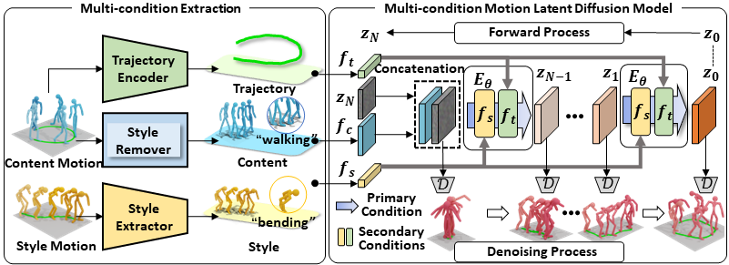

# Arbitrary Motion Style Transfer with Multi-condition Motion Latent Diffusion Model
[[project](https://xingliangjin.github.io/MCM-LDM-Web/)][[paper](https://openaccess.thecvf.com/content/CVPR2024/papers/Song_Arbitrary_Motion_Style_Transfer_with_Multi-condition_Motion_Latent_Diffusion_Model_CVPR_2024_paper.pdf)]

<p align="center"> <br></p>

> **Abstract:** Computer animation's quest to bridge content and style has historically been a challenging venture, with previous efforts often leaning toward one at the expense of the other. This paper tackles the inherent challenge of content-style duality, ensuring a harmonious fusion where the core narrative of the content is both preserved and elevated through stylistic enhancements. We propose a  novel Multi-condition Motion Latent Diffusion Model (MCM-LDM) for Arbitrary Motion Style Transfer (AMST). Our MCM-LDM significantly emphasizes preserving trajectories, recognizing their fundamental role in defining the essence and fluidity of motion content. Our MCM-LDM's cornerstone lies in its ability first to disentangle and then intricately weave together motion's tripartite components: motion trajectory, motion content, and motion style. The critical insight of MCM-LDM  is to embed multiple conditions with distinct priorities. The content channel serves as the primary flow, guiding the overall structure and movement, while the trajectory and style channels act as auxiliary components and synchronize with the primary one dynamically. This mechanism ensures that multi-conditions can seamlessly integrate into the main flow, enhancing the overall animation without overshadowing the core content. Empirical evaluations underscore the model's proficiency in achieving fluid and authentic motion style transfers, setting a new benchmark in the realm of computer animation.


## 👨‍🏫 Quick Start

This section provides a quick start guide to set up the environment and run the demo. The following steps will guide you through the installation of the required dependencies, downloading the pretrained models, and preparing the datasets. 

<details>
  <summary><b> 1. Conda environment </b></summary>

```
conda create python=3.9 --name mcmldm
conda activate mcmldm
```

Install the packages in `requirements.txt` and install [PyTorch 1.12.1](https://pytorch.org/).

```
pip install -r requirements.txt
```

We test our code on Python 3.9.16 and PyTorch 1.12.1.

</details>

<details>
  <summary><b> 2. Dependencies </b></summary>

Run the script to download dependencies materials:

```
bash prepare/download_smpl_models.sh
```
To evaluate the reconstruction performance of the model during training:
```
bash prepare/download_t2m_evaluators.sh
```

</details>

<details>
  <summary><b> 3. Pretrained models </b></summary>

Run the script to download the pretrained models:

```
bash prepare/download_pretrained_models.sh
```

</details>


<details>
  <summary><b> 4. (Optional) Download manually </b></summary>

Visit the [Google Driver](https://drive.google.com/drive/folders/1r6aDXpv_72whHxkJnSfOaJixavoer0Yf?usp=sharing) to download the previous dependencies and models.

</details>

<details>
  <summary><b> 5. Prepare the datasets </b></summary>

Please refer to [HumanML3D](https://github.com/EricGuo5513/HumanML3D) for dataset setup. Copy the result dataset to our repository:
```
cp -r ../HumanML3D/HumanML3D ./datasets/humanml3d
```


</details>


## 🎬 Demo

<details>
  <summary><b> Motion Style Transfer (using provided motions in 'demo' floder) </b></summary>

Run the following script:

```
python demo_transfer.py --cfg ./configs/config_mld_humanml3d.yaml --cfg_assets ./configs/assets.yaml --style_motion_dir demo/style_motion --content_motion_dir demo/content_motion --scale 2.5
```

Some parameters:

- `--style_motion_dir`: input style motion floder
- `--content_motion_dir`: input content motion floder
- `--scale`: the classifier-free guidance parameter (control the intensity of style)

The outputs:

- `npy file`: the generated motions with the shape of (nframe, 22, 3)
- `mp4 file`: the generated motion videos

</details>


## 🚀 Train your own models

Please update the parameters in `configs/config_mld_humanml3d.yaml`, e.g. `NAME`,`DEBUG`,`PRETRAINED_VAE` 

Then, run the following command:

```
python -m train --cfg configs/config_mld_humanml3d.yaml --cfg_assets configs/assets.yaml --batch_size 128 --nodebug
```


## Acknowledgements
Our code is mostly taken from the following repositories: \
[Executing your Commands via Motion Diffusion in Latent Space](https://github.com/ChenFengYe/motion-latent-diffusion). \
[MotionCLIP: Exposing Human Motion Generation to CLIP Space](https://github.com/GuyTevet/MotionCLIP). \
We sincerely thank these authors for their awesome work.
